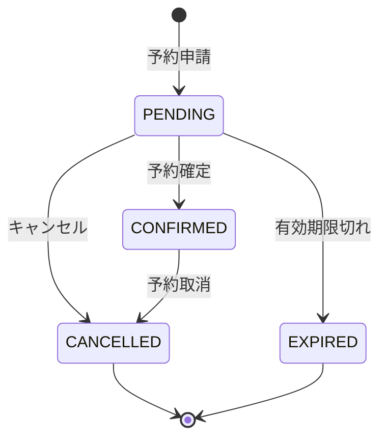
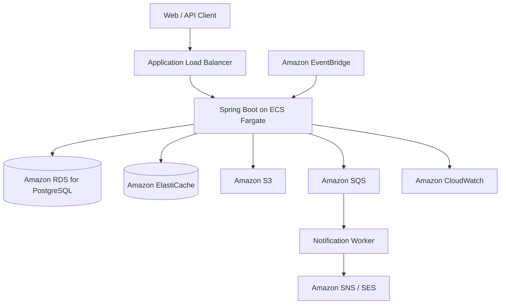

# Cloud Reservation Service

Spring Boot 4 と AWS を使用して構築する、クラウドネイティブな予約・在庫管理サービスです。

AWS Certified Solutions Architect – Associate（SAA）の学習で得た知識を、実際のアプリケーション設計・開発・デプロイを通じて実践することを目的としています。

> **Status:** 🚧 Planning / Initial development  
> 本リポジトリは現在開発中です。以下の構成には、実装予定の機能および目標アーキテクチャが含まれます。

## Project Goals

- Spring Boot 4 / Java 21 を用いたモダンなバックエンド開発
- 同時予約における在庫超過を防ぐ整合性制御
- AWS マネージドサービスを活用した疎結合なシステム構成
- コンテナ化、監視、セキュリティ、障害耐性を考慮した設計
- Infrastructure as Code と CI/CD による再現可能な環境構築

## Use Case

イベント、講座、施設などの予約枠を管理し、ユーザーがオンラインで予約できるサービスを想定しています。

主なユースケース：

- ユーザー登録・認証
- イベントおよび予約枠の検索
- 予約の作成・確定・キャンセル
- 同時アクセス時の在庫管理
- 予約期限切れの自動処理
- 予約結果の非同期通知
- 管理者によるイベント・在庫・予約状況の管理

## Reservation Lifecycle

## Target Architecture

AWS 上では、アプリケーションをコンテナとして ECS Fargate に配置し、RDS で永続データを管理します。予約後の通知処理は SQS を介して非同期化し、CloudWatch でログ・メトリクス・アラームを管理する構成を目指します。

## Technology Stack

| Category | Technology |
|---|---|
| Language | Java 21 |
| Framework | Spring Boot 4 |
| Build | Maven |
| API | Spring MVC / REST |
| Persistence | Spring Data JPA, PostgreSQL |
| Security | Spring Security |
| Cache | Redis / Amazon ElastiCache |
| Messaging | Amazon SQS |
| Storage | Amazon S3 |
| Container | Docker |
| AWS Runtime | Amazon ECS on AWS Fargate |
| Monitoring | Amazon CloudWatch |
| Infrastructure as Code | Terraform or AWS CDK |
| CI/CD | GitHub Actions |
| Testing | JUnit 5, Testcontainers |

## Key Engineering Topics

### Inventory consistency

同一予約枠に複数のリクエストが集中した場合でも、在庫数を超えて予約が成立しないよう、データベーストランザクションと排他制御を用いて整合性を保証します。

### Idempotency

クライアントの再送やメッセージの再配信が発生しても、同じ予約や通知が重複して処理されないよう、冪等性を考慮して設計します。

### Asynchronous processing

予約処理と通知処理を SQS で分離し、通知サービスの一時的な障害が予約処理全体に影響しない構成を目指します。失敗したメッセージは Dead Letter Queue で管理します。

### Security

IAM の最小権限、Secrets Manager による認証情報管理、入力値検証、認証・認可を実装し、機密情報をソースコードやコンテナイメージに含めない方針とします。

### Observability

構造化ログ、ヘルスチェック、メトリクス、CloudWatch Alarm を利用し、障害の検知と原因調査が可能な状態を目指します。

## Planned Domain Model

| Entity | Responsibility |
|---|---|
| User | 利用者情報と権限 |
| Event | 予約対象となるイベント・施設 |
| Inventory | 予約可能数と在庫状態 |
| Reservation | 予約内容とステータス |
| Notification | 通知内容と送信結果 |

## Roadmap

- [x] Spring Boot 4 / Java 21 プロジェクトの初期構築
- [x] フレームワーク非依存のドメインモデルと単体テスト
- [x] PostgreSQL を使用した永続化層の実装
- [x] イベント・予約 API の実装
- [ ] バリデーションと統一例外処理
- [ ] 同時予約に対する在庫整合性制御
- [ ] Spring Security による認証・認可
- [ ] Testcontainers を使用した結合テスト
- [ ] Docker イメージの作成
- [ ] ECS Fargate / RDS へのデプロイ
- [ ] SQS を使用した非同期通知
- [ ] S3 を使用したファイル管理
- [ ] CloudWatch による監視・アラーム
- [ ] Terraform または AWS CDK による IaC
- [ ] GitHub Actions による CI/CD

## Local Development

ローカル実行手順は、アプリケーションの初期構築後に追記します。

想定する前提環境：

- JDK 21
- Docker
- Docker Compose
- Maven Wrapper

## License

This project is for personal learning and portfolio purposes.
